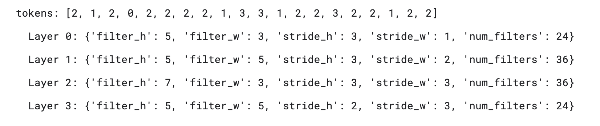

# Neural Architecture Search with Reinforcement Learning

Implementation of [Neural Architecture Search with Reinforcement Learning](https://arxiv.org/abs/1611.01578) (Zoph & Le, 2017).

A controller LSTM learns to generate neural network architectures by treating architecture design as a reinforcement learning problem. 

## Phase 1: 

### Image Classification
1.1 Baseline: The controller samples architectures, trains them on CIFAR-10, and uses validation accuracy as a reward signal to improve future samples via REINFORCE.

---

## Results

- **Best val accuracy (during NAS):** 74.98%
- **Test accuracy:** 74.70%
- **Architectures explored:** 100 (20 batches × 5 per batch)
- **Best architecture found:**


---

## Files
Image Classification/Baseline-simplest
| File | Purpose |
|------|---------|
| `run.py` | Entry point — runs NAS then evaluates best architecture on test set |
| `train.py` | Outer NAS loop — controller updates via REINFORCE |
| `controller.py` | 2-layer LSTM that samples CNN architectures token by token |
| `child_network.py` | Builds, trains, and evaluates a candidate CNN |
| `data_loader.py` | Loads CIFAR-10 from HuggingFace, handles train/val/test splits |

---
# NAS with skip 

## Overview

The controller learns to propose increasingly better convolutional architectures by:

1. Sampling layer configurations (filter size, stride, number of filters) using an LSTM
2. Sampling skip connections between layers using an attention mechanism
3. Training each sampled ("child") network on CIFAR-10
4. Using validation accuracy as the reward to update the controller via policy gradient

The search progressively increases network depth from 6 to 12 layers over the course of training.

---

## Architecture

```
Controller (LSTM)
    │
    ├─ samples tokens → layer configs (filter_h, filter_w, stride_h, stride_w, num_filters)
    ├─ samples skip connections via attention
    │
    ▼
Child Network (ConvNet)
    │
    ├─ ConvBlocks with BatchNorm + ReLU
    ├─ Skip connections merged by channel-wise concatenation
    ├─ Global Average Pooling
    └─ Linear classifier (10 classes)
    │
    ▼
Validation Accuracy → Reward → Controller Update (REINFORCE)
```

---

## Requirements

```
torch
torchvision
datasets        # HuggingFace datasets
Pillow
matplotlib      # optional, for plotting
```

Install with:

```bash
pip install torch torchvision datasets pillow matplotlib
```

---

## Usage

**Run the full NAS search + final test evaluation:**

```bash
python run.py
```

**Run the search only (skip final test retraining):**

```bash
python run.py --skip-test
```

---

## Configuration

All hyperparameters are set in the `CONFIG` dictionary near the top of the script:

| Parameter | Default | Description |
|---|---|---|
| `lstm_hidden_size` | 35 | Controller LSTM hidden units |
| `lstm_num_layers` | 2 | Controller LSTM depth |
| `embedding_dim` | 8 | Token embedding size |
| `controller_lr` | 0.0006 | Adam LR for controller |
| `num_batches` | 10 | Number of controller update steps |
| `m` | 5 | Child networks sampled per batch |
| `child_epochs` | 20 | Epochs to train each child (paper uses 50) |
| `batch_size` | 128 | Dataloader batch size |
| `baseline_decay` | 0.95 | EMA decay for reward baseline |
| `entropy_coeff` | 0.0001 | Entropy regularisation coefficient |
| `start_layers` | 6 | Initial child network depth |
| `depth_increase_every` | 6 | Batches between depth increments |
| `depth_increment` | 2 | Layers added at each depth increase |
| `max_layers` | 12 | Maximum child network depth |
| `seed` | 42 | Random seed |

---

## Outputs

All outputs are written to the `results/` directory:

| File | Description |
|---|---|
| `results/history.json` | Per-architecture log: tokens, configs, reward, val accuracy, baseline |
| `results/best_checkpoint.pt` | Controller weights + best architecture found |
| `results/nas_progress.png` | Plot of val accuracy and EMA baseline over search |
| `results/test_result.json` | Final test accuracy of the best architecture |

---

## Search Space

Each layer is defined by 5 tokens:

| Token | Values |
|---|---|
| Filter height | 1, 3, 5, 7 |
| Filter width | 1, 3, 5, 7 |
| Stride height | 1, 2, 3 |
| Stride width | 1, 2, 3 |
| Num filters | 6, 12, 24, 36 |

Skip connections between non-adjacent layers are sampled using a learned attention mechanism, allowing the controller to discover residual-style connectivity.

---

## Data

CIFAR-10 is loaded automatically from HuggingFace (`uoft-cs/cifar10`) and split into:

- **Train:** 45,000 images (with augmentation: pad → random crop → horizontal flip)
- **Validation:** 5,000 images
- **Test:** 10,000 images

---

## Results
This is the result after running for 10 baches of 20 epochs each:


## How It Works
run `Bash run.sh`

---

